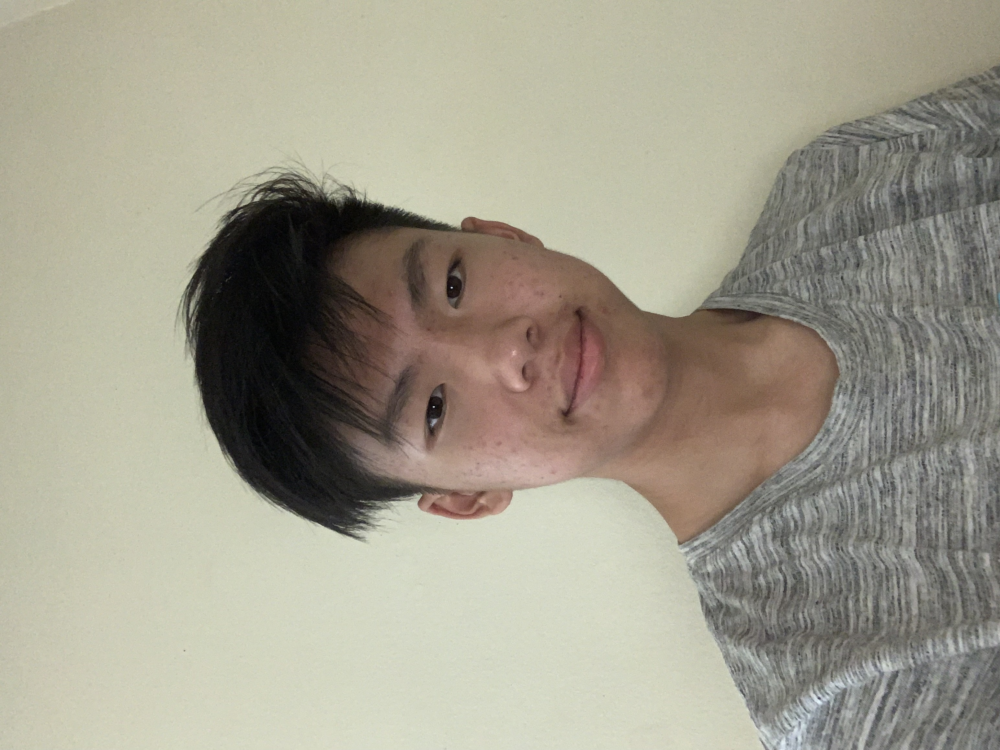

# CSE 110 Lab 1

## Introduction
Hello, my name is **Steven Nguyen**. I am a second year computer science major in Sixth College. I am currently a tutor for Gary Gillespie for CSE 12 and CSE 15L. I only started coding since the beginning of college, so I am newer comparatively to many others.

##### Random Quote
A quote I can appreciate by Joe E. Lewis is:
> "You only live once - but if you work it right, once is enough." 

Using `git push` will be one of the last commands I do before the publishment of this website.

In case you need my [Github](https://github.com/nguyens00047), here it is!

# TABLE OF CONTENTS
[Introduction](##Introduction)
[Random-Quote](#####Random-Quote)
[My-Hobbies](######My-Hobbies)

If you would like to read more about anything, you can refer to this [document](README.md)

##### My Hobbies
- Dancing
- Cooking
- Piano
- Watching Shows

###### Foods I want to make
- [x] Ramen
- [ ] Friend Pork Cutlet with Curry
- [ ] Crepes
